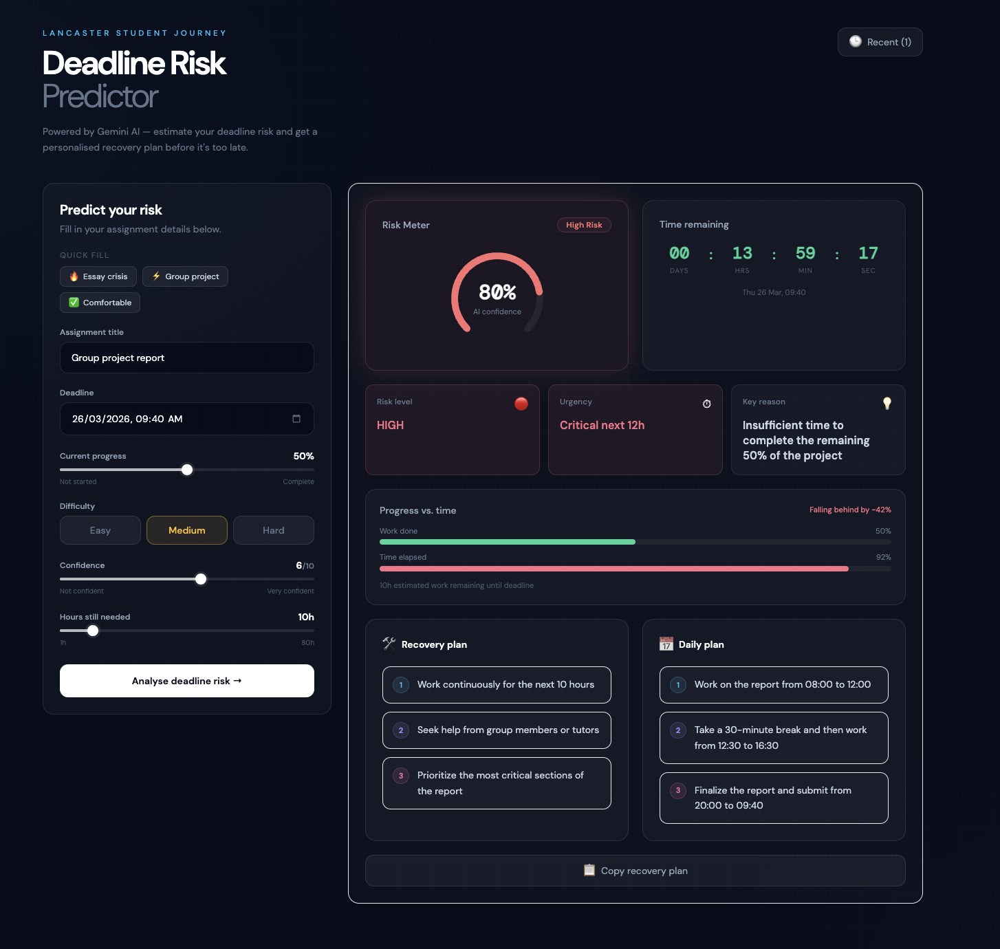

# Deadline Risk Predictor

> AI-powered deadline risk estimation for Lancaster University students.

Built with **Next.js 14**, **TypeScript**, **Tailwind CSS**, and **Groq AI** (llama-3.3-70b-versatile). Enter your assignment details and get an instant risk assessment, recovery plan, and live countdown — before it's too late.

---

## Screenshot



---

## What it does

Students enter details about an upcoming assignment — title, deadline, current progress, difficulty, confidence level, and estimated hours remaining. The app sends this to Groq's Llama model, which returns:

- A **risk level** (low / medium / high) with a confidence score
- A short **reason** explaining the primary risk factor
- A **3-step recovery plan** with actionable items
- A **daily study plan** with time-blocked steps
- A live **countdown timer** to the deadline
- A **progress vs. time bar** showing whether work is keeping pace

All results are saved locally so you can compare previous analyses.

---

## Tech stack

| Layer      | Technology                        |
| ---------- | --------------------------------- |
| Framework  | Next.js 14 (App Router)           |
| Language   | TypeScript                        |
| Styling    | Tailwind CSS + DM Sans font       |
| AI model   | Groq — `llama-3.3-70b-versatile`  |
| AI SDK     | `groq-sdk`                        |
| State      | React `useState` + `localStorage` |
| Deployment | Vercel (recommended)              |

---

## Getting started

### 1. Clone the repository

```bash
git clone https://github.com/latika-sisodiya/deadline-risk-predictor.git
cd deadline-risk-predictor
```

### 2. Install dependencies

```bash
npm install
```

### 3. Get a Groq API key

1. Go to [console.groq.com](https://console.groq.com)
2. Sign up or log in
3. Navigate to **API Keys** and create a new key

### 4. Set up environment variables

Create a `.env.local` file in the root of the project:

```env
GROQ_API_KEY=your_groq_api_key_here
```

> ⚠️ Never commit `.env.local` to GitHub. It is already in `.gitignore`.

### 5. Run locally

```bash
npm run dev
```

Open [http://localhost:3000](http://localhost:3000) in your browser.

---

## Project structure

```
deadline-risk-predictor/
├── app/
│   ├── api/
│   │   └── analyze/
│   │       └── route.ts        # Groq API route with validation
│   ├── globals.css              # Fonts, animations, base styles
│   ├── layout.tsx              # Root layout and metadata
│   └── page.tsx                # Main page with state and layout
│
├── components/
│   ├── InputPanel.tsx          # Form with sliders, toggles, presets
│   ├── ResultPanel.tsx         # Result layout and copy button
│   ├── RiskGauge.tsx           # Animated SVG arc gauge
│   ├── CountdownCard.tsx       # Live-ticking countdown timer
│   ├── ProgressTimeBar.tsx     # Progress vs time dual bar
│   ├── RecoveryPlanCard.tsx    # Numbered step plan cards
│   └── StatCard.tsx            # Small stat display card
│
├── lib/
│   └── types.ts                # Shared TypeScript types
│
├── .env.local                  # Your API key (not committed)
├── .gitignore
├── next.config.js
├── tailwind.config.ts
└── README.md
```

---

## How AI is used

The app sends a structured prompt to Groq's `llama-3.3-70b-versatile` model via the `/api/analyze` route. The prompt includes all six assignment fields plus a calculated `hoursUntilDeadline` value derived from the deadline date.

The model is instructed via a system message to respond with **JSON only** — no markdown, no explanation. A JSON extraction function strips any accidental formatting before parsing.

Key prompt logic:

- If `hoursLeft > hoursUntilDeadline`, the model is told this is a **critical risk signal**
- Low progress + hard difficulty + low confidence is flagged as high risk
- Temperature is set to `0.4` for consistent, focused outputs
- `max_tokens` is capped at `600` to prevent runaway responses

---

## Features

- **Animated risk gauge** — SVG arc sweeps in on load, colour-coded by risk level
- **Live countdown** — ticks every second, turns amber under 12h, red under 4h
- **Sliders** for progress, confidence, and hours (replaces raw number inputs)
- **Difficulty toggle** — Easy / Medium / Hard with colour-coded buttons
- **Quick-fill presets** — Essay crisis, Group project, Comfortable scenarios
- **Progress vs. time bar** — shows if your work is keeping pace with time elapsed
- **Analysis history** — last 5 analyses saved in `localStorage`, reloadable
- **Copy recovery plan** — copies formatted plan to clipboard
- **Skeleton loading** — card outlines appear while AI is thinking
- **Input validation** — submit button disabled until title and deadline are filled
- **15-second timeout** — AbortController cancels hung requests cleanly
- **API validation** — server rejects malformed requests before touching Groq

---

## Limitations

- Analysis quality depends on the accuracy of the inputs — estimated hours remaining is self-reported
- `localStorage` history is browser-specific and clears if storage is wiped
- Groq free tier has rate limits — avoid rapid repeated submissions
- The countdown timer uses the client's local system clock

---

## Licence

MIT — free to use, modify, and distribute.
